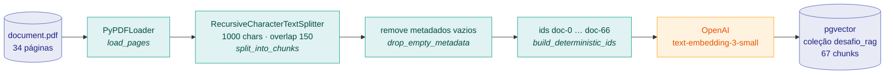
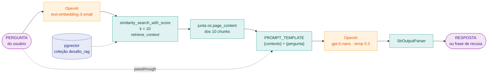
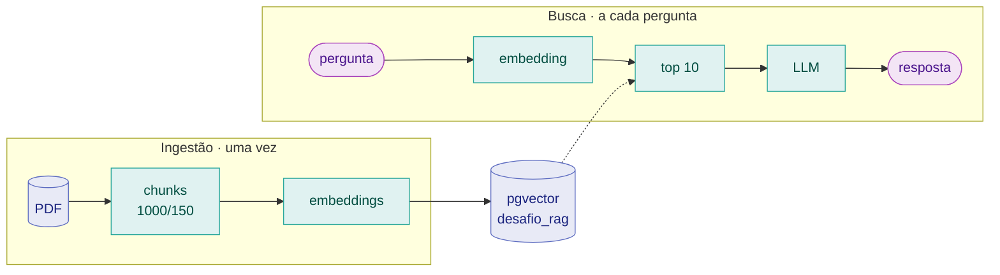

# Fluxos da aplicação

Dois fluxos independentes, ligados apenas pela coleção no pgvector. A ingestão roda uma vez;
a busca roda a cada pergunta.

---

## 1. Ingestão do PDF

`python src/ingest.py`



**Por que cada passo existe**

| Passo | Motivo |
|---|---|
| `overlap 150` | O PDF é uma tabela. O corte a cada 1000 caracteres parte linhas no meio; o overlap faz a linha partida reaparecer inteira no chunk seguinte |
| `drop_empty_metadata` | O `pypdf` devolve campos vazios (`creationdate: ''`) que sujariam o `jsonb` sem servir para nada |
| `build_deterministic_ids` | Ids posicionais tornam a reexecução um upsert — rodar duas vezes não duplica |

---

## 2. Pergunta e resposta

`python src/chat.py`



A pergunta segue por dois caminhos ao mesmo tempo: vira vetor para buscar os chunks que
preenchem o `{contexto}`, e chega intacta ao `{pergunta}` do template. É o que a chain LCEL
expressa:

```python
{
    "contexto": RunnableLambda(retrieve_context),
    "pergunta": RunnablePassthrough(),
}
| PromptTemplate.from_template(PROMPT_TEMPLATE)
| llm
| StrOutputParser()
```

**Onde a recusa acontece:** não há filtro por score. Os 10 chunks vêm sempre, relevantes ou
não. Quem decide recusar é o `PROMPT_TEMPLATE`, ao constatar que a resposta não está no
`{contexto}`.

---

## Os dois fluxos lado a lado



O acoplamento entre os dois é uma variável só: `PG_VECTOR_COLLECTION_NAME`. E uma regra —
**os dois lados precisam usar o mesmo modelo de embeddings**. Vetores de modelos diferentes não
são comparáveis, e a busca degradaria em silêncio. É por isso que `ingest.py` e `search.py`
pedem o modelo ao `providers.py` em vez de instanciarem o seu próprio.
