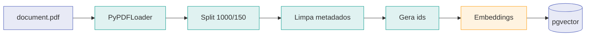
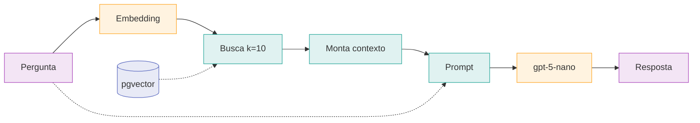
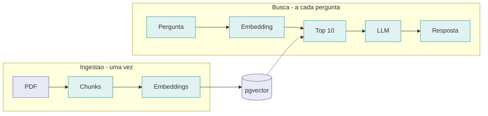

# Fluxos da aplicação

Dois fluxos independentes, ligados apenas pela coleção no pgvector. A ingestão roda uma vez;
a busca roda a cada pergunta.

---

## 1. Ingestão do PDF

`python src/ingest.py`



| Etapa | O que acontece | Por que existe |
|---|---|---|
| `PyPDFLoader` | 34 páginas viram Documents | — |
| Split | 1000 caracteres, overlap 150 → 67 chunks | O PDF é uma tabela: o corte parte linhas no meio, e o overlap faz a linha partida reaparecer inteira no chunk seguinte |
| Limpa metadados | Remove campos vazios | O `pypdf` devolve `creationdate: ''`, que sujaria o `jsonb` sem servir para nada |
| Gera ids | `doc-0` … `doc-66` | Ids posicionais tornam a reexecução um upsert — rodar duas vezes não duplica |
| Embeddings | `text-embedding-3-small`, 1536 dimensões | — |

---

## 2. Pergunta e resposta

`python src/chat.py`



A linha pontilhada de `Pergunta` para `Prompt` é o segundo caminho: a pergunta vira vetor para
buscar os chunks que preenchem o `contexto`, e ao mesmo tempo chega intacta ao template. É o que
a chain expressa:

```python
{
    "contexto": RunnableLambda(retrieve_context),
    "pergunta": RunnablePassthrough(),
}
| PromptTemplate.from_template(PROMPT_TEMPLATE)
| llm
| StrOutputParser()
```

**Onde a recusa acontece:** não há filtro por score. Os 10 chunks vêm sempre, relevantes ou não.
Quem decide recusar é o `PROMPT_TEMPLATE`, ao constatar que a resposta não está no contexto.

---

## Os dois fluxos lado a lado



O acoplamento entre os dois é uma variável só: `PG_VECTOR_COLLECTION_NAME`. E uma regra — **os
dois lados precisam usar o mesmo modelo de embeddings**. Vetores de modelos diferentes não são
comparáveis, e a busca degradaria em silêncio. É por isso que `ingest.py` e `search.py` pedem o
modelo ao `providers.py` em vez de instanciarem o seu próprio.
